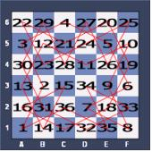

# [1331] 나이트 투어
### **난이도**
실버 4
## **📝문제**
나이트 투어는 체스판에서 나이트가 모든 칸을 정확히 한 번씩 방문하며, 마지막으로 방문하는 칸에서 시작점으로 돌아올 수 있는 경로이다. 다음 그림은 나이트 투어의 한 예이다.



영식이는 6×6 체스판 위에서 또 다른 나이트 투어의 경로를 찾으려고 한다. 체스판의 한 칸은 A, B, C, D, E, F 중에서 하나와 1, 2, 3, 4, 5, 6 중에서 하나를 이어 붙인 것으로 나타낼 수 있다. 영식이의 나이트 투어 경로가 주어질 때, 이것이 올바른 것이면 Valid, 올바르지 않으면 Invalid를 출력하는 프로그램을 작성하시오.

### **입력**
36개의 줄에 나이트가 방문한 순서대로 입력이 주어진다. 체스판에 존재하는 칸만 입력으로 주어진다.
### **출력**
첫째 줄에 문제의 정답을 출력한다.
### **예제입출력**

**예제 입력1**

```
A1
B3
A5
C6
E5
F3
D2
F1
E3
F5
D4
B5
A3
B1
C3
A2
C1
E2
F4
E6
C5
A6
B4
D5
F6
E4
D6
C4
B6
A4
B2
D1
F2
D3
E1
C2
```

**예제 출력1**

```
Valid
```

**예제 입력2**

```
A1
C2
E3
F5
D4
B3
A1
C2
E3
F5
D4
B3
A1
C2
E3
F5
D4
B3
A1
C2
E3
F5
D4
B3
A1
C2
E3
F5
D4
B3
A1
C2
E3
F5
D4
B3
```

**예제 출력2**

```
Invalid
```

**예제 입력3**

```
```

**예제 출력3**

```
```

## **🧐CODE REVIEW**

### **🧾나의 풀이**

```python
chess = [[0 for i in range(6)] for i in range(6)]
move = []

def calc(a):
    if a[0] == 'A':
        width = 0
    elif a[0] == 'B':
        width = 1
    elif a[0] == 'C':
        width = 2
    elif a[0] == 'D':
        width = 3
    elif a[0] == 'E':
        width = 4
    elif a[0] == 'F':
        width = 5

    height = int(a[1]) - 1

    return width, height
    

for i in range(36):
    move.append(str(input()))
    width, height = calc(move[i])

    chess[width][height] += 1

flag = 1
for i in range(1, len(move)):
    width_1, height_1 = calc(move[i-1])
    width_2, height_2 = calc(move[i])

    if abs(width_1 - width_2) == 2 and abs(height_1 - height_2) == 1:
        pass
    elif abs(width_1 - width_2) == 1 and abs(height_1 - height_2) == 2:
        pass
    else:
        flag = 0

start_width, start_height = calc(move[0])
end_width, end_height = calc(move[35])

if abs(start_width - end_width) == 2 and abs(start_height - end_height) == 1:
    pass
elif abs(start_width - end_width) == 1 and abs(start_height - end_height) == 2:
    pass
else:
    flag = 0

for i in chess:
    for j in i:
        if j >= 2:
            flag = 0
            break

if flag == 1:
    print('Valid')
else:
    print('Invalid')
```

결과	| 메모리(KB) |	시간(ms) |	언어 |	코드 길이(B)
:----:|:-----:|:-----:|:-----:|:--------:
정답|31120|44|python3|1231
#### **📝해설**

**알고리즘**
```
```

#### **😅개선점**

1. 코드 길이를 줄여서 좀더 최적화가 되었으면 좋겠음
2. 배열을 많이 생성해서 메모리를 많이 할당함
3. 6*6이 아니라 더 큰 규모였다면 아마 제한시간을 맞추지 못할 것 같음


### **다른 풀이**

```python
import sys

if __name__ == '__main__':
    route = list()
    for _ in range(36):
        route.append(sys.stdin.readline().rstrip())

    if len(set(route)) != 36:
        print('Invalid')
        exit()

    for i in range(36):
        diff_row = abs(ord(route[i][0])-ord(route[i-1][0]))
        diff_col = abs(int(route[i][1])-int(route[i-1][1]))
        if (diff_row == 1 and diff_col == 2) or (diff_row == 2 and diff_col == 1):
            continue
        else:
            print('Invalid')
            exit()
    print('Valid')
```

아이디 |	문제	| 문제 제목 |	결과	| 메모리(KB) |	시간(ms) |	언어 |	코드 길이(B) 
:-----:|:-----:|:---------:|:-----:|:-----:|:-----:|:----:|:--------:
movegreen|1331|나이트 투어|정답|30616|36|Python3|534
