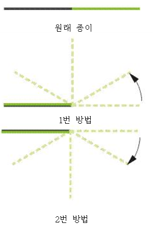
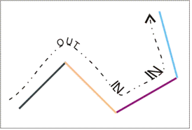

# [1802] 종이접기

### **난이도**
실버1

## **📝문제**
동호는 종이를 접는데 옆에서 보고 접으려고 한다. 옆에서 본다는 말은 아래 그림과 같이 본다는 뜻이다. 동호는 종이를 반으로 접을 때, 아래와 같이 두가지중 하나로만 접을 수 있다.

1. 오른쪽 반을 반시계 방향으로 접어서 왼쪽 반의 위로 접는다.
2. 오른쪽 반을 시계 방향으로 접어서 왼쪽 반의 아래로 접는다.
아래의 그림은 위의 설명을 그림으로 옮긴 것이다.



한 번의 종이 접기가 끝났을 때, 동호는 종이 접기를 원하는 만큼 더 할 수 있다. 종이 접기를 한번 접을 때 마다 두께는 2배가 되고 길이는 절반이 될 것이다.


종이 접기를 여러 번 했을 때 (안접을 수도 있다), 동호는 종이를 다시 피기로 했다. 그러고 나서 다시 접고 이렇게 놀고 있었다. 옆에서 보고 있던 원룡이는 동호를 위해 종이를 접어서 주기로 했다.(원룡이는 동호의 규칙대로 접지 않는다.) 동호는 그리고 나서 원룡이가 접었다 핀 종이를 다시 동호의 규칙대로 접을 수 있는지 궁금해졌다.

위의 저 종이를 접었다 피면 다음과 같은 그림처럼 펴진다.



종이가 시계방향으로 꺽여있으면 OUT이고, 반시계방향으로 꺾여있으면 IN이다.

종이가 접혀있는 정보가 왼쪽부터 오른쪽까지 차례대로 주어졌을 때, 이 종이를 동호의 규칙대로 접을 수 있는지 없는지를 구하는 프로그램을 작성하시오.

### **입력**
첫째 줄에 테스트 케이스의 개수 T가 주어진다. T는 1000보다 작거나 같은 자연수이다. 둘째 줄부터 T개의 줄에 각각의 종이가 어떻게 접혀있는지가 주어진다. 종이의 정보는 문자열로 주어지며, 1은 위의 그림에서 OUT을 의미하고 0은 위의 그림에서 IN을 의미한다. 예를 들어, 위의 그림과 같은 모양은 100으로 나타낼 수 있다. 문자열의 길이는 3000보다 작으며, 항상 2N-1꼴이다. (N ≥ 1)
### **출력**
T개의 줄에 차례대로 각각의 종이를 동호의 방법대로 다시 접을 수 있으면 YES를, 접을 수 없으면 NO를 출력한다.
### **예제입출력**

**예제 입력1**

```
3
0
000
1000110
```

**예제 출력1**

```
YES
NO
YES
```

## **🧐CODE REVIEW**

### **😫나의 오답 풀이**
### **🧾나의 풀이**

```python
T = int(input())

def origami(paper, N):

    if N == 1:
        return 0
    if N == 3:
        if paper[0] + paper[2] == 1:
            return 0
        else:
            return 1
    
    left_half = paper[:(N-1)//2]
    right_half = paper[(N+1)//2:]

    for i in range((N-1)//2):
        if paper[i] + paper[N-1-i] == 1:
            result = 0
        else:
            result = 1
            break


    return origami(left_half, (N-1)//2) + origami(right_half, (N-1)//2) + result


for testcase in range(1, T+1):
    in_out = list(map(int, list(input())))

    paper_length = len(in_out)
    result = origami(in_out, paper_length)

    if result == 0:
        print('YES')
    else:
        print('NO')
```

결과	| 메모리(KB) |	시간(ms) |	언어 |	코드 길이(B)
:----:|:-----:|:-----:|:-----:|:--------:
정답|31120|56|Python3|709

#### **📝해설**

**알고리즘**
```
1. 분할 정복
2. 재귀
```

#### **😅개선점**

1. 재귀함수가 아닌 반복문으로도 풀 수 있었을 것 같다


### **다른 풀이**

```python
import sys

input = sys.stdin.readline

def isAvailableStr(str):
    todo = list(str)

    while len(todo) >= 3:
        for i in range(2, len(todo), 2):
            if todo[i-2] == todo[i]:
                return False

        nextTodo = []
        for i in range(1, len(todo), 2):
            nextTodo.append(todo[i])

        todo = nextTodo

    return True


T = int(input())
for _ in range(T):
    curInput = str(input().rstrip())

    if isAvailableStr(curInput):
        print("YES")
    else:
        print("NO")
```

|	결과	| 메모리(KB) |	시간(ms) |	언어 |	코드 길이(B) 
|:-----:|:-----:|:-----:|:----:|:--------:
정답|31256|40|Python3|522


### **🔖정리**

1. 재귀함수의 사용법을 연습할 수 있었다.
