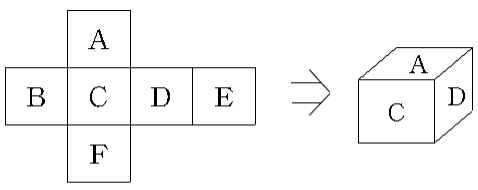

# [2116] 주사위 쌓기

### **난이도**
골드 5

## **📝문제**
천수는 여러 종류의 주사위를 가지고 쌓기 놀이를 하고 있다. 주사위의 모양은 모두 크기가 같은 정육면체이며 각 면에는 1부터 6까지의 숫자가 하나씩 적혀있다. 그러나 보통 주사위처럼 마주 보는 면에 적혀진 숫자의 합이 반드시 7이 되는 것은 아니다.

주사위 쌓기 놀이는 아래에서부터 1번 주사위, 2번 주사위, 3번 주사위, … 의 순서로 쌓는 것이다. 쌓을 때 다음과 같은 규칙을 지켜야 한다: 서로 붙어 있는 두 개의 주사위에서 아래에 있는 주사위의 윗면에 적혀있는 숫자는 위에 있는 주사위의 아랫면에 적혀있는 숫자와 같아야 한다. 다시 말해서, 1번 주사위 윗면의 숫자는 2번 주사위 아랫면의 숫자와 같고, 2번 주사위 윗면의 숫자는 3번 주사위 아랫면의 숫자와 같아야 한다. 단, 1번 주사위는 마음대로 놓을 수 있다.

이렇게 쌓아 놓으면 긴 사각 기둥이 된다. 이 사각 기둥에는 4개의 긴 옆면이 있다. 이 4개의 옆면 중에서 어느 한 면의 숫자의 합이 최대가 되도록 주사위를 쌓고자 한다. 이렇게 하기 위하여 각 주사위를 위 아래를 고정한 채 옆으로 90도, 180도, 또는 270도 돌릴 수 있다. 한 옆면의 숫자의 합의 최댓값을 구하는 프로그램을 작성하시오.

### **입력**
첫줄에는 주사위의 개수가 입력된다. 그 다음 줄부터는 한 줄에 하나씩 주사위의 종류가 1번 주사위부터 주사위 번호 순서대로 입력된다. 주사위의 종류는 각 면에 적혀진 숫자가 그림1에 있는 주사위의 전개도에서 A, B, C, D, E, F 의 순서로 입력된다. 입력되는 숫자 사이에는 빈 칸이 하나씩 있다. 주사위의 개수는 10,000개 이하이며 종류가 같은 주사위도 있을 수 있다.

### **출력**
첫줄에 한 옆면의 숫자의 합이 가장 큰 값을 출력한다.
### **예제입출력**

**예제 입력1**

```
5
2 3 1 6 5 4
3 1 2 4 6 5
5 6 4 1 3 2
1 3 6 2 4 5
4 1 6 5 2 3
```

**예제 출력1**

```
29
```


### **출처**

## **🧐CODE REVIEW**

### **🧾나의 풀이**

```python
num = int(input())
dices = [list(map(int, input().split())) for _ in range(num)]
result = [0] * 6
pair = [5, 3, 4, 1, 2, 0]


for start in range(1, 7):
    bottom = start
    bottom_idx = dices[0].index(bottom)
    top = dices[0][pair[bottom_idx]]
    top_idx = pair[bottom_idx]


    temp_dice = dices[0][:6]
    temp_dice[top_idx] = -1
    temp_dice[bottom_idx] = -1
    result[start-1] += max(temp_dice)
    for i in range(1, num):

        bottom = top
        bottom_idx = dices[i].index(bottom)
    
        top_idx = pair[bottom_idx]
        top = dices[i][top_idx]

        temp_dice = dices[i][:6]
        temp_dice[top_idx] = -1
        temp_dice[bottom_idx] = -1
        result[start-1] += max(temp_dice)

print(max(result))
```

결과	| 메모리(KB) |	시간(ms) |	언어 |	코드 길이(B)
:----:|:-----:|:-----:|:-----:|:--------:
정답|32140|500|Python3|735
#### **📝해설**

**알고리즘**
```
1. 브루트포스 알고리즘
```
결국 경우의 수는 시작점의 숫자의 개수밖에 없으니 총 6개이다  
따라서 모든 경우의 수를 계산하고 최대값을 구하면 된다
#### **😅개선점**

1. 함수를 사용해서 불필요한 코드의 중복을 피하면 코드의 길이를 줄일 수 있었을 것이다.


### **다른 풀이**

```python
import sys


def readline():
    return sys.stdin.readline().rstrip()


def main():
    n = int(readline())

    top_number = [1, 2, 3, 4, 5, 6]
    max_side = [0] * 6

    for _ in range(n):
        a, b, c, d, e, f = map(int, readline().split())
        dice = {
            a: (f, max(b, c, d, e)),
            b: (d, max(a, c, e, f)),
            c: (e, max(a, b, d, f)),
            d: (b, max(a, c, e, f)),
            e: (c, max(a, b, d, f)),
            f: (a, max(b, c, d, e)),
        }
        for i in range(6):
            top = top_number[i]
            top_number[i] = dice[top][0]
            max_side[i] += dice[top][1]
    print(max(max_side))


if __name__ == "__main__":
    main()

```

아이디 |	결과	| 메모리(KB) |	시간(ms) |	언어 |	코드 길이(B) 
:-----:|:-----:|:-----:|:-----:|:----:|:--------:
yckang1124|정답|31256|76|Python3|702

### **🔖정리**

1. 어렵게 생각하지 말고 모든 경우의 수를 고려해보자