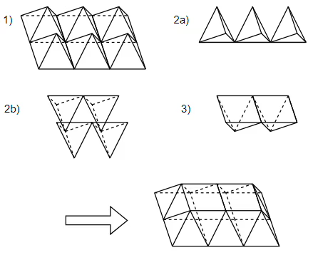

# [25793] 초콜릿 피라미드

### **난이도**
실버 1
## **📝문제**

코코는 특이하게 생긴 화이트 초콜릿과 다크 초콜릿을 무한히 많이 갖고 있다. 화이트 초콜릿은 각 모서리의 길이가 1인 사각 피라미드이고, 다크 초콜릿은 각 모서리의 길이가 1인 정사면체 모양이다. 어느 날 코코는 이 초콜릿들을 가지고 놀다가, 초콜릿을 잘 쌓으면 더 큰 사각 피라미드를 만들 수 있다는 사실을 알아냈다. 바닥면의 직사각형의 크기가 
$R \times C$인 피라미드를 쌓는 구체적인 방법은 다음과 같다.

먼저 바닥을 
$R \times C$개의 화이트 초콜릿으로 채운다.
화이트 초콜릿 사이사이를 다크 초콜릿으로 채운다.
다크 초콜릿 사이의 공간을 다시 화이트 초콜릿으로 채운다. 여기까지 진행하면 위쪽 면은 
$(R-1) \times (C-1)$ 크기의 평평한 직사각형이 된다.
윗면의 넓이가 0이 될 때까지 반복한다.
아래 그림은 
$2 \times 3$ 피라미드의 1층을 채우는 과정을 나타낸 것이다. 1층을 채우는 데에 화이트 초콜릿은 8개, 다크 초콜릿은 7개가 필요하고, 2층까지 합하면 각각 10개, 8개가 필요하다.


코코는 아주 큰 초콜릿 피라미드를 만들어 한별이에게 선물하려고 한다. 이 때 화이트와 다크 초콜릿이 각각 몇 개씩 필요한지 계산해주자.

### **입력**
첫 번째 줄에 테스트 케이스의 개수 
$T$가 주어진다. 다음 
$T$개의 줄 각각에는 정수 
$R$과 
$C$의 값이 순서대로 주어진다.
### **출력**
각 테스트 케이스에 대해, 필요한 화이트 초콜릿의 개수와 다크 초콜릿의 개수를 한 줄에 순서대로 출력한다.
### **예제입출력**

**예제 입력1**

```
2
2 3
10 10
```

**예제 출력1**

```
10 8
670 660
```

### **출처**
Contest > BOJ User Contest > 초콜릿컵 > 제1회 초콜릿컵 A번
## **🧐CODE REVIEW**

### **😫나의 오답 풀이**
### **🧾나의 풀이**

```python
testcase = int(input())
black_answer = []
white_answer = []

for case in range(testcase):
    r, c = map(int,input().split())
    m, n = max(r, c), min(r, c)
    k = m - n
    white = n*(n+1)*(2*n+1)//3 - n*(n+1) + n*(n+1)*k - n*k + n
    black = n*(n+1)*(2*n+1)//3 - n*(n+1) + n*(n+1)*k - n*k
    white_answer.append(white)
    black_answer.append(black)

for i in range(testcase):
    print(f'{white_answer[i]} {black_answer[i]}')
```

결과	| 메모리(KB) |	시간(ms) |	언어 |	코드 길이(B)
:----:|:-----:|:-----:|:-----:|:--------:
정답|40876|4776|Python3|432
#### **📝해설**

**알고리즘**
```
수학적 계산
```

#### **😅개선점**

1. 시간이 오래걸림

### **다른 풀이**

```python
import sys
input=sys.stdin.readline

def main():
    R,C=map(int,input().split())
    D=abs(R-C)
    N=min(R,C)
    ans=(N*(3*D*N+2*N*N+1))//3
    print(ans,ans-N)
        
for _ in range(int(input())):
    main()
```

아이디 |	문제	| 문제 제목 |	결과	| 메모리(KB) |	시간(ms) |	언어 |	코드 길이(B) 
:-----:|:-----:|:---------:|:-----:|:-----:|:-----:|:----:|:--------:
kkhmsg30|25793|초콜릿 피라미드|정답|30840|328|Python3|